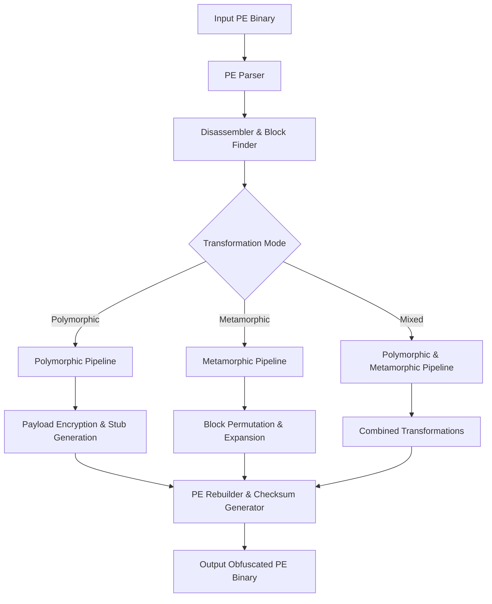

<div align="center">

```text
  ███╗   ███╗ █████╗ ██╗  ██╗███╗   ██╗███████╗
  ████╗ ████║██╔══██╗██║ ██╔╝████╗  ██║██╔════╝
██╔████╔██║███████║█████╔╝ ██╔██╗ ██║█████╗
██║╚██╔╝██║██╔══██║██╔═██╗ ██║╚██╗██║██╔══╝
  ██║ ╚═╝ ██║██║  ██║██║  ██╗██║ ╚████║███████╗
  ╚═╝     ╚═╝╚═╝  ╚═╝╚═╝  ╚═╝╚═╝  ╚═══╝╚══════╝
```
[](https://github.com/anonymouschichvy/makne/actions/workflows/publish.yml) [](https://pypi.org/project/makne/) [](https://pypi.org/project/makne/) [](https://opensource.org/licenses/MIT) [](https://github.com/anonymouschichvy/makne)

</div>

An advanced binary-level mutation and obfuscation framework for **PE (Portable Executable) both 32-bit (x86) and 64-bit (x64)** binaries written in C++17. Leveraging the high-performance **Zydis disassembler** backend, the engine dynamically parses PE files, identifies instruction/basic block boundaries, applies polymorphic and metamorphic transformation passes, and rebuilds the executable with modified section structures and updated PE metadata.

---

## 📂 Project Directory Structure

The project follows a clean, modular C++ directory layout separating definitions (headers) from source code and configurations:

```text
makne/
├── CMakeLists.txt              # Cross-platform build configuration
├── README.md                   # Project documentation
├── include/                    # Header files
│   ├── PEStructs.h             # Native PE structures definitions (DOS, COFF, Optional headers)
│   ├── CodeReorderer.h         # Basic block analysis and shuffling definitions
│   ├── ControlFlowObfuscator.h # Control flow flattening & opaque predicate definitions
│   ├── DataEncoder.h           # Data/String encoding & decoder stub generation
│   ├── DecryptorGenerator.h    # Polymorphic decryptor stub creation
│   ├── ImportObfuscator.h      # IAT obfuscation and API hashing definitions
│   ├── InstructionSubstitutor.h# Instruction-equivalent database mapping
│   ├── JunkCodeInserter.h      # Dead code/junk sequence generator
│   ├── MetamorphicEngine.h     # High-level metamorphic mutation pipeline
│   ├── PayloadEncryptor.h      # Section-level encryption management
│   ├── PolymorphicEngine.h     # Core processing, PE parsing, and orchestrator
│   ├── RegisterRandomizer.h    # ModR/M register mapping and randomization
│   ├── SectionRandomizer.h     # PE section name, layout, and alignment shuffler
│   └── Utils.h                 # Randomness and helper definitions
└── src/                        # Implementation files
    ├── main.cpp                # Command-line driver and argument parser
    ├── CodeReorderer.cpp       # Basic block identification, jump fixing, and shuffling
    ├── ControlFlowObfuscator.cpp # Flow flatters, dispatchers, and opaque predicates
    ├── DataEncoder.cpp         # XOR, Base64, and split-string algorithms
    ├── DecryptorGenerator.cpp  # Dynamic x86 assembly generator for decryption
    ├── ImportObfuscator.cpp    # IAT parsing, dynamic DLL resolution, and API hashing
    ├── InstructionSubstitutor.cpp # x86 equivalent instruction mapping execution
    ├── JunkCodeInserter.cpp    # NOP-equivalent & flag-safe instruction generation
    ├── MetamorphicEngine.cpp   # Loop unrolling, inlining, and expansion levels
    ├── PayloadEncryptor.cpp    # XOR encryption and decryption insertion logic
    ├── PolymorphicEngine.cpp   # Core engine implementation (PE parsing, rebuilding)
    ├── RegisterRandomizer.cpp  # Register swapping and translation tables
    ├── SectionRandomizer.cpp   # Section shuffling, renaming, and alignment fixing
    └── Utils.cpp               # Cryptographic RNG (CryptoRandom)
```

---

## 🛠 Features & Capabilities

The engine features two distinct modes of transformation which can be combined (Mixed Mode):

### 1. Polymorphic Transformations
*   **Zydis Disassembler Backend**: Replaced custom prefix/opcode length parsers with a full-featured Zydis decoder to safely identify x86/x64 instruction boundaries, decode operand layouts, and perform atomic byte stream modifications.
*   **Instruction Substitution**: Replaces instruction patterns with equivalent CPU sequences. For example:
    *   `MOV reg, Imm` $\rightarrow$ `PUSH Imm; POP reg`
    *   `XOR reg, reg` $\rightarrow$ `SUB reg, reg`
    *   `NOP` $\rightarrow$ `PUSH RBX; POP RBX` or `XCHG RAX, RAX`
    *   *x64 Safety Filter*: Automatically bypasses single-byte legacy `INC` (`0x40`) / `DEC` (`0x48`) substitutions on x64 targets to prevent collisions with the REX prefix byte range (`0x40-0x4F`).
    *   *Width Guards*: Substitutions for `ADD reg, 1 → INC reg`, `SUB reg, 1 → DEC reg`, and `CMP reg, 0 → TEST reg, reg` are restricted to 32-bit and 64-bit operand sizes only, preventing flag corruption on 8-bit/16-bit registers.
    *   *REX Prefix Scan*: The `LEA reg, [reg] → MOV reg, reg` substitution correctly skips legacy prefixes before checking for a valid REX prefix byte (`0x40–0x4F`) in 64-bit mode, preserving both legacy and REX prefixes to avoid encoding corruption.
*   **Register Randomizer**: Dynamically re-maps general-purpose register usage while adhering to strict architecture constraints:
    *   *Calling Convention Safe*: Preserves caller/callee boundary registers `RAX/EAX` (return values), `RCX/ECX, RDX/EDX, R8, R9` (arguments), `RSP/ESP, RBP/EBP` (stack frames), and `R12, R13` (special SIB addresses).
    *   *Partitioned Shuffle*: Safely shuffles registers only within legacy (`RBX, RSI, RDI`) and extension (`R10, R11, R14, R15`) groups, guaranteeing that instruction lengths and REX prefix status remain completely invariant.
    *   *Dynamic Implicit-Register Scan*: Decodes instruction operands to automatically detect and exclude implicit registers (e.g., EAX/EDX in division, or ESI/EDI/RSI/RDI in string operations) to prevent semantic corruption.
    *   *RIP-Relative Safe-guard*: Automatically bypasses register randomization on instructions containing RIP-relative or EIP-relative displacement addressing to maintain correct relative memory references.
*   **Import Obfuscation**: Erases the original Import Address Table (IAT) names and replaces them with dynamically generated import resolution stubs:
    *   *x86 targets*: Walks the 32-bit PEB `InMemoryOrderModuleList` via `FS:[0x30]`, uppercase case-folds Unicode `BaseDllName` characters, and resolves API addresses at runtime using a `ROR13-ADD` hash. The precomputed hash `0x6E2BCA17` identifies `KERNEL32.DLL` robustly regardless of module load order.
    *   *x64 targets*: Walks the 64-bit PEB `InMemoryOrderModuleList` via `GS:[0x60]`, implements full Microsoft x64 calling conventions with 32-byte stack shadow space allocation, and utilizes RIP-relative addressing to locate string table offsets.
*   **Exception Directory Relocation**: Automatically parses x64 `.pdata` runtime function tables and `UNWIND_INFO` structures to relocate 32-bit exception handler RVAs when shuffling or renaming PE sections. A `MapEndRVA` range helper correctly recalculates `EndAddress` for functions that grew in size during metamorphic transformation.
*   **Code Reordering (x86/x64)**: Groups functions by exact byte size and performs size-matched in-place swaps rather than appending to separate lists. This guarantees that every function's RVA — including those not being shuffled — remains identical to its original value, keeping `.rdata` switch-case jump tables correct while still randomizing thousands of same-sized functions. Zydis is used to parse branch offsets and relative memory displacements to patch targets.
*   **Junk Code Inserter (x86/x64)**: Inserts context-aware, benign junk instructions (e.g., flag-safe operations) to modify byte signatures without changing execution behavior. Stack pointer (`ESP`/`RSP`) and frame pointer (`EBP`/`RBP`) registers are explicitly excluded from the junk clobber mask using named Zydis register constants, preventing stack/frame corruption. Filters out x86-only instructions on x64.
*   **Control Flow Obfuscation (x86/x64)**: Distorts control flow by replacing jumps with equivalent joint condition pairs (e.g., `JO` + `JNO`) and Jcc conditions with inverted Jcc skips. All short jumps are expanded to near Jcc instructions with 4-byte displacements to eliminate offset overflow.
*   **Payload Encryption**: Encrypts target payload sections (XOR, etc.) and injects dynamically generated decryptor stubs as the entry point. Decryptor stub displacement offsets are calculated dynamically relative to the actual `POP` instruction address rather than using hardcoded values, ensuring correctness regardless of the size of any preceding anti-debug or anti-emulation stubs. On x64 targets, stubs use RIP-relative LEA instructions; on x86 targets, a call-pop GetPC technique is used.
*   **Data Encoding**: Encodes static data strings using XOR, Base64, or string-splitting to avoid detection of plaintext strings.

### 2. Metamorphic Transformations

The `MetamorphicEngine` runs **first** in the `PassManager` pipeline, before any other passes (such as `CodeReorderer`) shuffle instructions. This ordering ensures that control-flow disassembly and jump displacement decoding are always performed on instructions in their original layout.

*   **Zydis Intermediate Representation**: Disassembles and decodes target functions to an IR, rewriting displacements and `%rip`-relative displacements to patch jump offsets and relocations on mutations.
*   **Instruction Permutation (x86/x64)**: Alters instruction positions using Bernstein's data dependency conditions (RAW, WAR, WAW) while preserving stack frame layout registers (`RSP`, `ESP`, `RBP`, `EBP`).
*   **Code Expansion**: Expands instructions to multi-byte equivalents to vary executable sizing. A dynamic `maxRawSize` headroom limit (8 KB) is reserved per `.text` section to prevent size growth from overlapping adjacent sections.
*   **Localized Short Branch Expansion**: Short branch expansion is applied only inside `MetamorphicEngine::DisassembleToIR`, scoped to functions actually undergoing metamorphic transformation. This prevents excessive binary size growth from pre-emptive expansion across the entire code section.
*   **Loop Unrolling & Function Inlining**: Modifies the stack frame structure and execution sequence by eliminating calls and branches.
*   **Anti-Debugging / Anti-Emulation**: Integrates stubs to detect hypervisors, sandboxes, and debuggers (e.g., PEB checks, timing checks).
*   **FileAlignment Section Resizing**: Safely pads, resizes, and aligns raw PE section size growth to `FileAlignment` boundaries, automatically relocating the COFF symbol table to prevent symbol warnings or image loaders crash.
*   **Relocation Table Rebuilding**: Uses `MapRVA` (rather than `MapRVAStrict`) for mid-instruction base relocs pointing to absolute addresses, constrained to only shift RVAs within the `.text` section. This prevents corruption of relocations in `.data`, `.rdata`, or import sections.

---

## ⚙️ Compilation & Installation

This project can be compiled as a standalone C++ command-line tool, or installed as a Python package with programmatic C++ wrapper bindings.

### 🐍 Python Package Installation (via pip)

You can build and install the project directly as a Python package. The PEP 517 build backend (`scikit-build-core`) will automatically configure and build the C++ codebase via CMake when installing.

#### 1. Prerequisites
Ensure you have a C++17 compiler (MSVC on Windows, GCC on Linux, Clang on macOS) and CMake installed.
* **Windows Source Build Note**: If installing from source in a standard PowerShell/CMD terminal, you must specify the generator if MSVC tools are not in your path:
  ```powershell
  $env:CMAKE_GENERATOR="MinGW Makefiles"
  ```
  Alternatively, run the command inside a **Developer PowerShell for Visual Studio**.

#### 2. Install from PyPI (Production)
```bash
pip install makne
```

#### 3. Install from Source (Local Development)
Clone the repository and run:
```bash
# Editable install (recommended for developers)
pip install -e .

# Or standard local install
pip install .
```

#### 4. Verification & Usage
* **CLI usage**: Installing the package registers a global command-line entry point:
  ```bash
  makne --help
  ```
* **Python API usage**: You can run the obfuscator directly from Python scripts:
  ```python
  import makne

  # Obfuscate a PE binary
  return_code = makne.obfuscate("input.exe", "output.exe", ["--polymorphic", "--substitution"])
  if return_code == 0:
      print("Obfuscation successful!")
  ```

---

### 🖥️ Native C++ Standalone Compilation

If you prefer building a standalone native executable without Python, the build system utilizes **CMake** for configuration and building. The build system automatically fetches dependencies like **Zydis disassembler** and **Zycore** via CMake's `FetchContent` module during configuration, so no manual downloading of submodules is necessary.

### 🪟 Windows (MSVC)

#### 1. Prerequisites
* **Visual Studio 2019 or 2022** (Community, Professional, or Enterprise).
* During installation, ensure the **"Desktop development with C++"** workload is checked. This installs the MSVC compiler, CMake, and the required Windows SDKs.
* Alternatively, you can use standalone **CMake (3.15+)** and **Build Tools for Visual Studio**.

#### 2. Building from Command Line
Open **Developer PowerShell for VS** or **Developer Command Prompt for VS** and run:
```powershell
# Generate the build configuration
cmake -B build -S .

# Build the release binary
cmake --build build --config Release
```
The compiled executable `makne.exe` will be located in `build/Release/`.

#### 3. Building via Visual Studio (IDE)
1. Open Visual Studio.
2. Select **Open a local folder** and choose the root directory containing `CMakeLists.txt`.
3. Visual Studio will automatically detect and configure the CMake project.
4. Go to the menu: **Build > Build All** (or select the `makne.exe` startup item and press F5/Ctrl+F5 to build and run).

---

### 🐧 Linux (GCC/Clang)

#### 1. Prerequisites
Install CMake and a C++17 compatible compiler (GCC 8+ or Clang 7+):
* **Ubuntu / Debian**:
  ```bash
  sudo apt update
  sudo apt install -y build-essential cmake
  ```
* **Fedora / CentOS / RHEL**:
  ```bash
  sudo dnf groupinstall -y "Development Tools"
  sudo dnf install -y cmake
  ```
* **Arch Linux**:
  ```bash
  sudo pacman -Syu base-devel cmake
  ```

#### 2. Building
Open a terminal in the project root folder:
```bash
# Generate build configuration for a Release build
cmake -B build -S . -DCMAKE_BUILD_TYPE=Release

# Build the project
cmake --build build
```
The compiled executable `makne` will be located in `build/`.

---

### 🍎 macOS (Clang)

#### 1. Prerequisites
* **Xcode Command Line Tools**: Install them by running the following command in terminal:
  ```bash
  xcode-select --install
  ```
* **CMake**: Install CMake using a package manager:
  * **Homebrew** (Recommended):
    ```bash
    brew install cmake
    ```
  * **MacPorts**:
    ```bash
    sudo port install cmake
    ```

#### 2. Building
Open a terminal in the project root folder:
```bash
# Generate build configuration for a Release build
cmake -B build -S . -DCMAKE_BUILD_TYPE=Release

# Build the project
cmake --build build
```
The compiled executable `makne` will be located in `build/`.

---

## 🧠 System Architecture & Logic



### Flow Walkthrough

1.  **Parsing (PE Parser)**:
    Loads the raw byte stream of the target `.exe` file. Parses the DOS MZ signature, COFF Header, Optional Header, and Sections to build an in-memory structural mapping of code (`.text`) and data (`.data`, `.rdata`) segments.
2.  **Code Analysis & Disassembly**:
    Parses machine code instructions, determines byte length boundary offsets, identifies branches (jumps, calls), and isolates independent execution blocks (Basic Blocks).
3.  **Applying Mutations**:
    Runs the pipeline of selected obfuscation passes. `MetamorphicEngine` is always invoked first so that disassembly and jump displacement decoding operate on the original instruction layout before any reordering or substitution passes shift RVAs. The engine tracks offset modifications since instruction substitution, junk insertion, and block shuffling alter virtual addresses (RVAs).
4.  **Header Reconstruction & Rebuilding**:
    Adjusts relocations, recalculates Entry Point (OEP), shifts Section Headers offsets, fixes the Import Address Table (IAT) pointers, generates dynamic import-resolving stubs, computes a new PE checksum, and saves the new output binary.

---

## 🚀 CLI Usage & Examples

### Usage syntax:
* **Windows (PowerShell/CMD)**:
  ```powershell
  .\makne.exe <input.exe> <output.exe> [options]
  ```
* **Linux / macOS**:
  ```bash
  ./makne <input.exe> <output.exe> [options]
  ```

### CLI Command Options

| Option | Category | Description |
| :--- | :--- | :--- |
| `--polymorphic` | Transformation | Apply polymorphic transformations (Default) |
| `--metamorphic` | Transformation | Apply metamorphic transformations |
| `--mixed` | Transformation | Combine both polymorphic & metamorphic pipelines |
| `--substitution` | Polymorphic | Enable instruction substitutions |
| `--registers` | Polymorphic | Enable register randomization |
| `--reorder` | Polymorphic | Enable basic block code reordering |
| `--junk` | Polymorphic | Enable junk/dead code insertion |
| `--cflow` | Polymorphic | Enable control flow obfuscation (flattening/predicates) |
| `--encrypt` | Polymorphic | Enable payload section encryption |
| `--data` | Polymorphic | Enable static data/string encoding |
| `--sections` | Polymorphic | Randomize section names and layout |
| `--imports` | Polymorphic | Obfuscate IAT and import names |
| `--permute <1-5>` | Metamorphic | Set instruction permutation complexity level |
| `--expand <1-5>` | Metamorphic | Set code expansion multiplier |
| `--garbage <1-5>` | Metamorphic | Set junk insertion density |
| `--unroll` | Metamorphic | Enable loop unrolling |
| `--inline` | Metamorphic | Enable function inlining |
| `--antidebug` | Advanced | Add anti-debugger stub detections |
| `--antiemu` | Advanced | Add anti-emulation timing checks |
| `--level <1-5>` | Advanced | Set global obfuscation intensity (default: 3) |
| `--iterations <n>`| Advanced | Number of mutation passes to run |
| `--help` | General | Display help documentation |

### Command Examples

Below are examples of how to run the engine. Make sure to run them from the directory containing the compiled executable (`build/` or `build/Release/`), or provide the full path to it.

#### 1. Display Help & Options
Verify the installation and see the full list of supported parameters.
* **Windows (PowerShell)**:
  ```powershell
  .\makne.exe --help
  ```
* **Linux / macOS**:
  ```bash
  ./makne --help
  ```

#### 2. Standard Polymorphic Obfuscation
Applies instruction substitutions, register randomization, code reordering, and section name/layout randomization.
* **Windows (PowerShell)**:
  ```powershell
  .\makne.exe input.exe output.exe --polymorphic --substitution --registers --reorder --sections
  ```
* **Linux / macOS**:
  ```bash
  ./makne input.exe output.exe --polymorphic --substitution --registers --reorder --sections
  ```
* **Explanation of flags**:
  * `--polymorphic`: Activates the polymorphic transformation pipeline.
  * `--substitution`: Replaces common instruction patterns with equivalent sequences.
  * `--registers`: Randomizes general-purpose register usage safely.
  * `--reorder`: Partitions code into size-matched function groups and shuffles them in-place, preserving all RVAs while maximizing randomization.
  * `--sections`: Randomizes PE section names and structural layout.

#### 3. Advanced Metamorphic Obfuscation
Applies aggressive code expansion, high complexity instruction permutations, loop unrolling, and function inlining.
* **Windows (PowerShell)**:
  ```powershell
  .\makne.exe input.exe output.exe --metamorphic --permute 5 --expand 4 --unroll --inline
  ```
* **Linux / macOS**:
  ```bash
  ./makne input.exe output.exe --metamorphic --permute 5 --expand 4 --unroll --inline
  ```
* **Explanation of flags**:
  * `--metamorphic`: Activates the metamorphic transformation pipeline.
  * `--permute 5`: Sets the highest complexity (level 5) for instruction permutation.
  * `--expand 4`: Sets the code expansion multiplier to 4.
  * `--unroll`: Enables optimization loop unrolling.
  * `--inline`: Inlines function calls where safe.

#### 4. Full Polymorphic Suite
Combines all polymorphic passes simultaneously for maximum coverage.
* **Windows (PowerShell)**:
  ```powershell
  .\makne.exe input.exe output.exe --polymorphic --substitution --registers --reorder --junk --cflow --encrypt --imports
  ```
* **Linux / macOS**:
  ```bash
  ./makne input.exe output.exe --polymorphic --substitution --registers --reorder --junk --cflow --encrypt --imports
  ```

#### 5. Mixed Maximum Protection (Combined Pipeline)
Combines all metamorphic and polymorphic features, flattens control flow, obfuscates import tables, encodes static strings, adds anti-analysis/debugger/emulation checks, and runs multiple passes.
* **Windows (PowerShell)**:
  ```powershell
  .\makne.exe input.exe output.exe --mixed --cflow --encrypt --imports --data --antidebug --antiemu --level 5 --iterations 2
  ```
* **Linux / macOS**:
  ```bash
  ./makne input.exe output.exe --mixed --cflow --encrypt --imports --data --antidebug --antiemu --level 5 --iterations 2
  ```
* **Explanation of flags**:
  * `--mixed`: Runs both the polymorphic and metamorphic pipelines sequentially.
  * `--cflow`: Distorts control flow via dispatchers and opaque predicates.
  * `--encrypt`: Encrypts target sections and inserts a decryption stub at the entry point.
  * `--imports`: Obfuscates the Import Address Table (IAT) and dynamically resolves DLLs via PEB walking.
  * `--data`: Encodes static strings (XOR/Base64/splitting).
  * `--antidebug` & `--antiemu`: Injects checks to detect debuggers, hypervisors, and sandboxes.
  * `--level 5`: Sets global intensity to maximum (5).
  * `--iterations 2`: Runs the entire mutation pipeline twice to generate nested layers of obfuscation.

---

## ⚖️ License & Disclaimer

This software is developed strictly for **educational, security research, and defensive binary analysis** purposes. Using this software to obfuscate malware to bypass anti-virus scanners for unauthorized deployment is strictly prohibited and a violation of local and international laws. The developers assume no liability for misuse of this tool.
